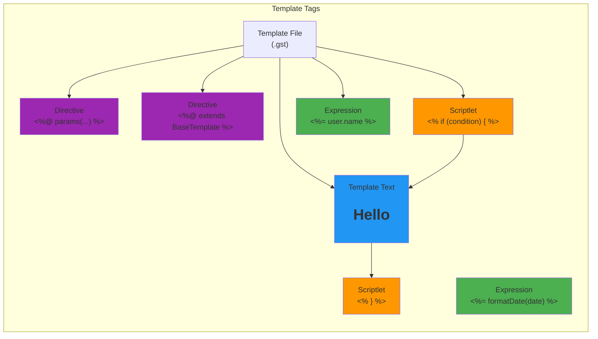
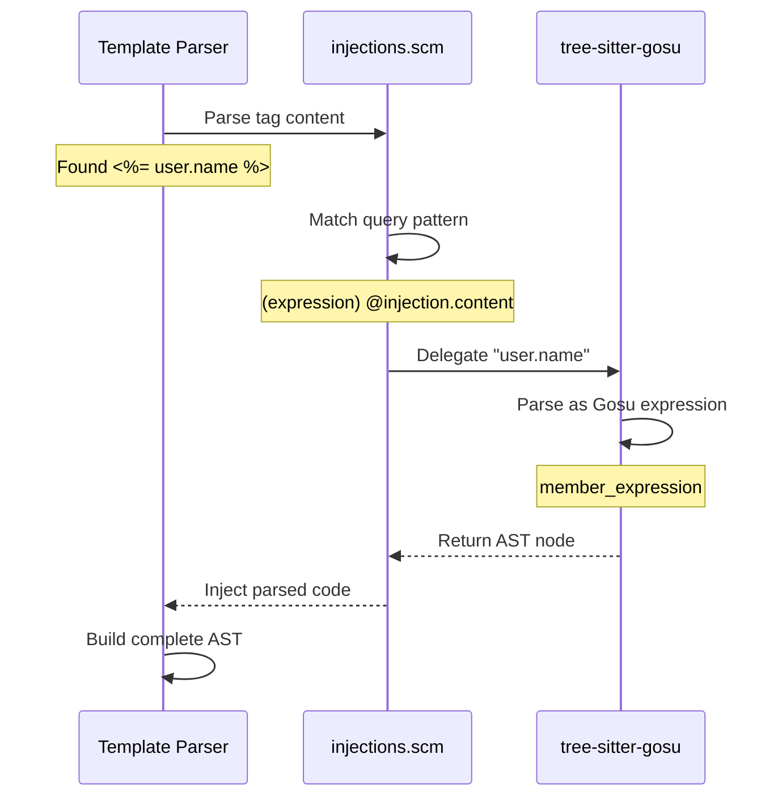

# tree-sitter-gosu-template

**Tree-sitter grammar for Gosu Template files (.gst)**

[](https://nodejs.org/)
[](https://tree-sitter.github.io/)
[](https://github.com/ashan/tree-sitter-gosu)

A specialized [Tree-sitter](https://tree-sitter.github.io/) parser for **Gosu Template (*.gst)** files, the server-side templating language used in Guidewire applications.

---

## 📋 Overview

Gosu Templates combine static HTML/text with dynamic Gosu code execution. This parser identifies:

- 🎯 **Directives**: `<%@ params(...) %>`, `<%@ extends ... %>`
- 🔧 **Scriptlets**: `<% ... %>` (Gosu code blocks)
- 📝 **Expressions**: `<%= ... %>` (output expressions)
- 📄 **Template Content**: Static text/HTML between tags
- 🔗 **Gosu Code Injection**: Delegates to `tree-sitter-gosu` for code parsing

---

## 🏗️ Architecture

### Template Parser Structure

```mermaid
graph TB
    subgraph "Input"
        GST[Gosu Template File<br/>.gst]
    end
    
    subgraph "Template Parser"
        LEX[Lexer<br/>Identify Tags]
        EXT[External Scanner<br/>scanner.c]
        TMPL[Template Grammar<br/>grammar.js]
    end
    
    subgraph "Content Classification"
        DIR[Directives<br/><%@ ... %>]
        SCRIPT[Scriptlets<br/><% ... %>]
        EXPR[Expressions<br/><%= ... %>]
        TEXT[Template Text<br/>HTML/Static]
    end
    
    subgraph "Gosu Integration"
        INJ[Injection Queries<br/>injections.scm]
        GOSU[tree-sitter-gosu<br/>Code Parser]
    end
    
    subgraph "Output"
        AST[Complete AST<br/>Template + Code]
    end
    
    GST --> LEX
    LEX --> EXT
    EXT --> TMPL
    
    TMPL --> DIR
    TMPL --> SCRIPT
    TMPL --> EXPR
    TMPL --> TEXT
    
    DIR --> INJ
    SCRIPT --> INJ
    EXPR --> INJ
    
    INJ --> GOSU
    GOSU --> AST
    TEXT --> AST
    
    style AST fill:#4CAF50
    style GOSU fill:#2196F3
    style EXT fill:#FF9800
```

### Template Tag Types



### Injection Mechanism

The parser uses **injection queries** to delegate Gosu code parsing:



---

## ✨ Features

### Template Elements

- ✅ **Directives**: Parameter declarations, template inheritance
- ✅ **Scriptlets**: Multi-line Gosu code blocks
- ✅ **Expressions**: Single-line output expressions
- ✅ **Comments**: `<%-- Template comments --%>`
- ✅ **Template Content**: Preserves whitespace and formatting
- ✅ **Nested Gosu**: Full Gosu language support via injection

### Gosu Code Support

All Gosu features are supported inside template tags:
- String interpolation
- Closures and blocks
- Complex expressions
- Method calls
- Control flow

**Example:**
```gsttemplate
<%@ params(users: List<User>) %>
<%@ extends layouts.Base %>

<h1>User List</h1>
<ul>
<% users.each(\-> user { %>
  <li><%= "${user.firstName} ${user.lastName}" %></li>
<% }) %>
</ul>
```

---

## 🚀 Installation

### Prerequisites

- Node.js 18+ (Node 20 or 22 LTS recommended)
- Build tools for native compilation
- `tree-sitter-gosu` (automatic via dependencies)

**macOS:**
```bash
xcode-select --install
```

**Linux (Ubuntu/Debian):**
```bash
sudo apt-get install -y build-essential python3
```

**Windows:**
```bash
choco install visualstudio2022buildtools
```

### Installing from GitHub

```bash
npm install github:ashan/tree-sitter-gosu-template
```

### As a Dependency

Add to `package.json`:
```json
{
  "dependencies": {
    "tree-sitter": "^0.25.0",
    "tree-sitter-gosu-template": "github:ashan/tree-sitter-gosu-template"
  }
}
```

---

## 💻 Usage

### Node.js API

```javascript
const Parser = require('tree-sitter');
const GosuTemplate = require('tree-sitter-gosu-template');

const parser = new Parser();
parser.setLanguage(GosuTemplate);

const sourceCode = `
<%@ params(name: String) %>
<h1>Hello <%= name %>!</h1>
<% if (name.length > 5) { %>
  <p>Long name!</p>
<% } %>
`;

const tree = parser.parse(sourceCode);
console.log(tree.rootNode.toString());

// Navigate the AST
tree.rootNode.children.forEach(node => {
  console.log(`${node.type}: ${node.text}`);
});
```

### CLI Verification

```bash
# Verify single file (recommended)
npm run verify path/to/template.gst

# Bulk analysis
npm run analyze ./path/to/templates

# Note: tree-sitter parse may not work correctly
# Use npm run verify for accurate parsing
```

> **⚠️ Important**: The `tree-sitter parse` CLI command may incorrectly select the `gosu` grammar instead of `gosu-template`. Always use `npm run verify` for accurate template parsing.

---

## 📁 Project Structure

```
tree-sitter-gosu-template/
├── grammar.js             # Template grammar definition
├── src/
│   ├── scanner.c         # External scanner for template content
│   └── parser.c          # Generated parser
├── bindings/
│   └── node/             # Node.js bindings
│       ├── binding.cc    # N-API wrapper
│       └── index.js      # JavaScript entry
├── queries/
│   ├── highlights.scm    # Syntax highlighting
│   ├── tags.scm          # Symbol indexing
│   └── injections.scm    # Gosu code injection rules
├── test/
│   └── corpus/           # Template test cases
├── scripts/
│   ├── analyze_failures.ts
│   └── verify_file.ts
└── prebuilds/            # Platform binaries
```

---

## 🧪 Testing

### Run Corpus Tests

```bash
npm test
```

### Verify Single Template

```bash
npm run verify path/to/template.gst
```

**Output:**
```
✅ Parsed successfully
📊 Nodes: 47
📝 Root: template
```

### Bulk Analysis

```bash
npm run analyze ./gsrc/templates
```

**Output:**
```
✅ Analyzed 234 templates
✅ Success: 234 (100%)
❌ Failures: 0

📊 Performance: 89 files/sec
```

---

## 🔍 Injection Queries

The parser uses `queries/injections.scm` to delegate Gosu code parsing:

```scheme
; Inject Gosu into directives
((directive
  (directive_content) @injection.content)
 (#set! injection.language "gosu"))

; Inject Gosu into scriptlets
((scriptlet
  (scriptlet_content) @injection.content)
 (#set! injection.language "gosu"))

; Inject Gosu into expressions
((expression
  (expression_content) @injection.content)
 (#set! injection.language "gosu"))
```

This enables full Gosu language support within template tags.

---

## 🎨 Example Templates

### Simple Directive

```gsttemplate
<%@ params(title: String, items: List<String>) %>
<h1><%= title %></h1>
<ul>
<% for (item in items) { %>
  <li><%= item %></li>
<% } %>
</ul>
```

**AST Structure:**
```
template
├── directive (params)
│   └── params_list
├── template_text ("<h1>")
├── expression
│   └── identifier (title)
├── template_text ("</h1><ul>")
├── scriptlet
│   └── for_statement
├── template_text ("<li>")
├── expression
│   └── identifier (item)
└── template_text ("</li></ul>")
```

### Template Inheritance

```gsttemplate
<%@ extends layouts.BasePage %>

<%@ override function title(): String { %>
  Dashboard
<% } %>

<%@ override function content() { %>
  <div class="dashboard">
    <h2>Welcome <%= currentUser.name %>!</h2>
  </div>
<% } %>
```

---

## 🐛 Troubleshooting

### "tree-sitter parse" Returns Errors

**Problem:** The CLI selects the wrong grammar.

**Solution:** Use the verification script:
```bash
npm run verify file.gst
```

### Template Content Not Parsed

**Problem:** External scanner may not recognize tag boundaries.

**Solution:** Ensure tags are properly closed:
```gsttemplate
<!-- ❌ Wrong -->
<% if (condition) 
  print("test")
%>

<!-- ✅ Correct -->
<% if (condition) {
  print("test")
} %>
```

### Missing Gosu Syntax Support

**Problem:** Injection not working.

**Solution:** Verify `tree-sitter-gosu` is installed:
```bash
npm list tree-sitter-gosu
```

---

## 🔧 Development

### Building from Source

```bash
git clone https://github.com/ashan/tree-sitter-gosu-template.git
cd tree-sitter-gosu-template
npm install
npm run build
npm test
```

### Grammar Development

```bash
# Edit grammar.js
nano grammar.js

# Regenerate parser
npm run build

# Test changes
npm test

# Verify with real templates
npm run analyze ./test-templates
```

---

## 📊 Performance

**Parsing Speed:**
- Simple templates: ~1000 files/sec
- Complex templates: ~200 files/sec

**Memory:**
- Parser: ~4MB
- AST: ~1.5x template file size

---

## 🤝 Contributing

### Adding Prebuilds

We need builds for **Linux** and **Windows**:

```bash
git clone https://github.com/ashan/tree-sitter-gosu-template.git
cd tree-sitter-gosu-template
npm install
npx prebuildify --napi --strip
git add -f prebuilds/
git commit -m "chore: add prebuilds for [platform]"
git push
```

---

## 📄 License

MIT License

---

## 🙏 Acknowledgments

- [Tree-sitter](https://tree-sitter.github.io/) for the parser framework
- [tree-sitter-gosu](https://github.com/ashan/tree-sitter-gosu) for Gosu code parsing
- [Guidewire Software](https://www.guidewire.com/) for Gosu Templates
- The Guidewire developer community

---

## 📞 Support

- **Issues**: [GitHub Issues](https://github.com/ashan/tree-sitter-gosu-template/issues)
- **Discussions**: [GitHub Discussions](https://github.com/ashan/tree-sitter-gosu-template/discussions)
- **Email**: k.a.a.dilantha@gmail.com

---

**Built with ❤️ for the Guidewire community**
